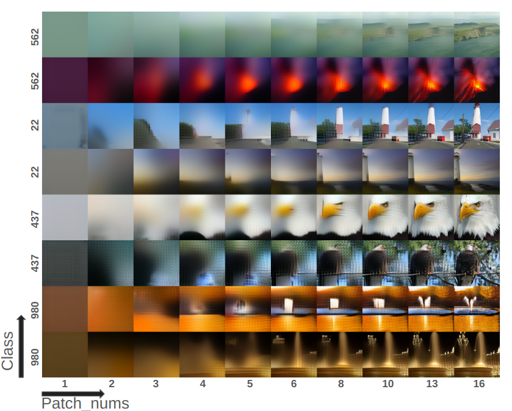
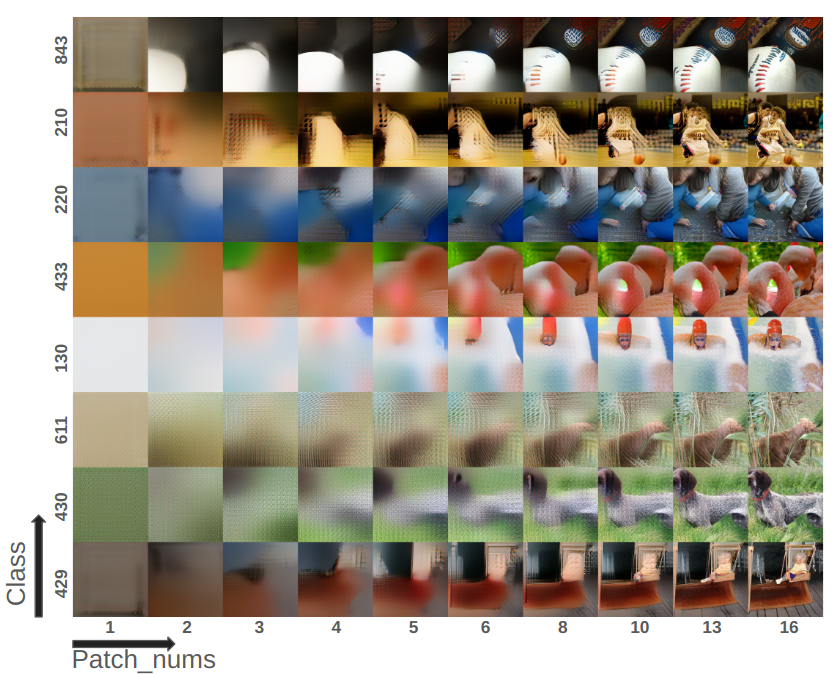

# This Repository for analysis VAR(Visual Autoregressive Modeling)

<div align="center">

[](https://var.vision/demo)&nbsp;
[](https://arxiv.org/abs/2404.02905)&nbsp;
[](https://huggingface.co/FoundationVision/var)&nbsp;
[![SOTA](https://img.shields.io/badge/State%20of%20the%20Art-Image%20Generation%20on%20ImageNet%20%28AR%29-32B1B4?logo=data%3Aimage%2Fsvg%2Bxml%3Bbase64%2CPHN2ZyB3aWR0aD0iNjA2IiBoZWlnaHQ9IjYwNiIgeG1sbnM9Imh0dHA6Ly93d3cudzMub3JnLzIwMDAvc3ZnIiB4bWxuczp4bGluaz0iaHR0cDovL3d3dy53My5vcmcvMTk5OS94bGluayIgb3ZlcmZsb3c9ImhpZGRlbiI%2BPGRlZnM%2BPGNsaXBQYXRoIGlkPSJjbGlwMCI%2BPHJlY3QgeD0iLTEiIHk9Ii0xIiB3aWR0aD0iNjA2IiBoZWlnaHQ9IjYwNiIvPjwvY2xpcFBhdGg%2BPC9kZWZzPjxnIGNsaXAtcGF0aD0idXJsKCNjbGlwMCkiIHRyYW5zZm9ybT0idHJhbnNsYXRlKDEgMSkiPjxyZWN0IHg9IjUyOSIgeT0iNjYiIHdpZHRoPSI1NiIgaGVpZ2h0PSI0NzMiIGZpbGw9IiM0NEYyRjYiLz48cmVjdCB4PSIxOSIgeT0iNjYiIHdpZHRoPSI1NyIgaGVpZ2h0PSI0NzMiIGZpbGw9IiM0NEYyRjYiLz48cmVjdCB4PSIyNzQiIHk9IjE1MSIgd2lkdGg9IjU3IiBoZWlnaHQ9IjMwMiIgZmlsbD0iIzQ0RjJGNiIvPjxyZWN0IHg9IjEwNCIgeT0iMTUxIiB3aWR0aD0iNTciIGhlaWdodD0iMzAyIiBmaWxsPSIjNDRGMkY2Ii8%2BPHJlY3QgeD0iNDQ0IiB5PSIxNTEiIHdpZHRoPSI1NyIgaGVpZ2h0PSIzMDIiIGZpbGw9IiM0NEYyRjYiLz48cmVjdCB4PSIzNTkiIHk9IjE3MCIgd2lkdGg9IjU2IiBoZWlnaHQ9IjI2NCIgZmlsbD0iIzQ0RjJGNiIvPjxyZWN0IHg9IjE4OCIgeT0iMTcwIiB3aWR0aD0iNTciIGhlaWdodD0iMjY0IiBmaWxsPSIjNDRGMkY2Ii8%2BPHJlY3QgeD0iNzYiIHk9IjY2IiB3aWR0aD0iNDciIGhlaWdodD0iNTciIGZpbGw9IiM0NEYyRjYiLz48cmVjdCB4PSI0ODIiIHk9IjY2IiB3aWR0aD0iNDciIGhlaWdodD0iNTciIGZpbGw9IiM0NEYyRjYiLz48cmVjdCB4PSI3NiIgeT0iNDgyIiB3aWR0aD0iNDciIGhlaWdodD0iNTciIGZpbGw9IiM0NEYyRjYiLz48cmVjdCB4PSI0ODIiIHk9IjQ4MiIgd2lkdGg9IjQ3IiBoZWlnaHQ9IjU3IiBmaWxsPSIjNDRGMkY2Ii8%2BPC9nPjwvc3ZnPg%3D%3D)](https://paperswithcode.com/sota/image-generation-on-imagenet-256x256?tag_filter=485&p=visual-autoregressive-modeling-scalable-image)


</div>
<p align="center" style="font-size: larger;">
  <a href="https://arxiv.org/abs/2404.02905">Visual Autoregressive Modeling: Scalable Image Generation via Next-Scale Prediction</a>
</p>

<p align="center">

<p>

<br>

## Analysis

### How Model Generate Image?
Generate Image with depth 30 model



* Model Generate Image Coarse-to-Fine
* low resolution token determines the overall color
* high resolution token gradually adds detailed information in a residual manner

### Failure Image
  

* Model can't generate person (I think this is becuase there is no prior on people)
* Model can't generate when there are multiple objects (I guess...)

## License
This project is licensed under the MIT License - see the [LICENSE](LICENSE) file for details.


## Citation
If our work assists your research, feel free to give us a star ⭐ or cite us using:
```
@Article{VAR,
      title={Visual Autoregressive Modeling: Scalable Image Generation via Next-Scale Prediction}, 
      author={Keyu Tian and Yi Jiang and Zehuan Yuan and Bingyue Peng and Liwei Wang},
      year={2024},
      eprint={2404.02905},
      archivePrefix={arXiv},
      primaryClass={cs.CV}
}
```
